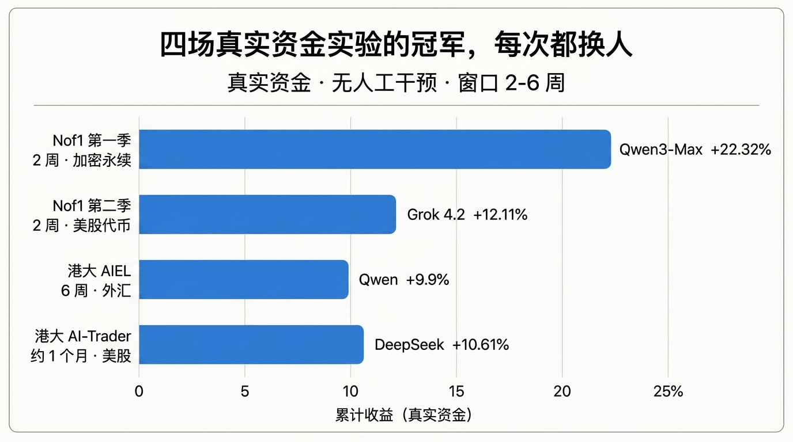
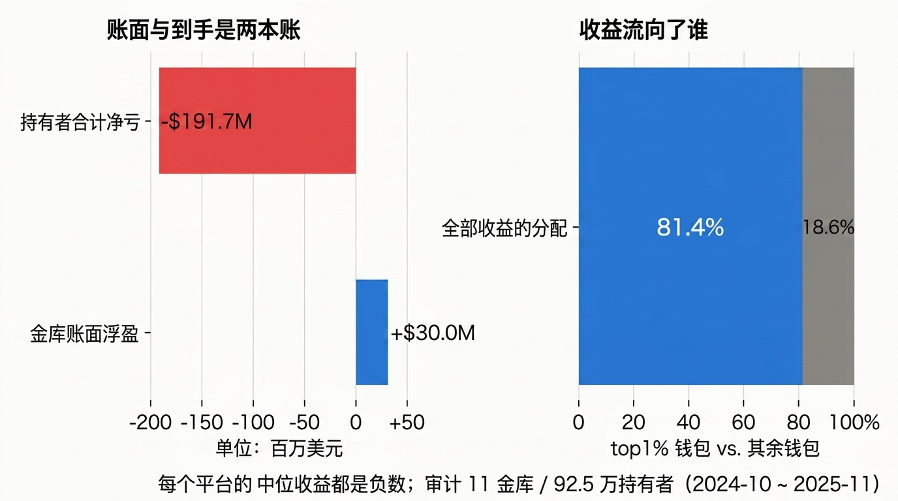
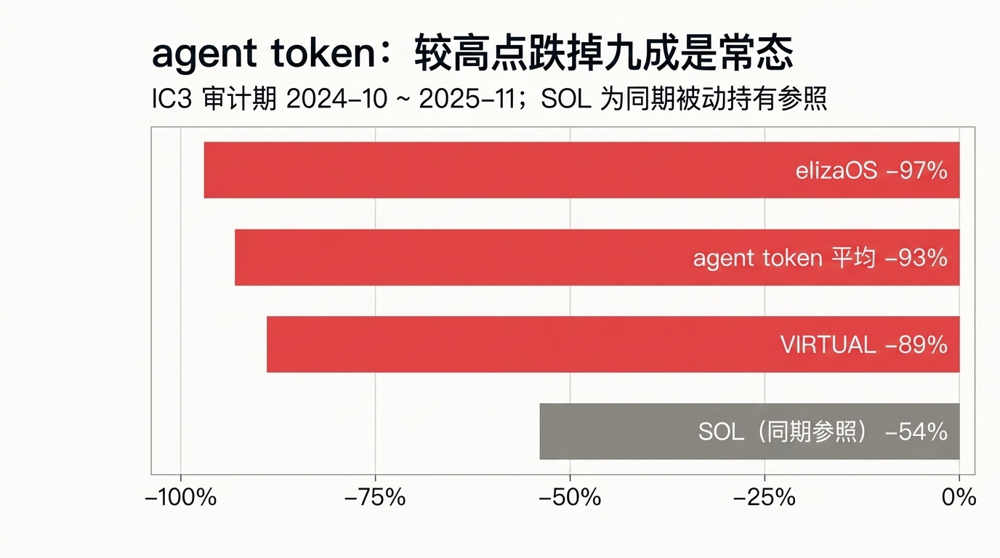
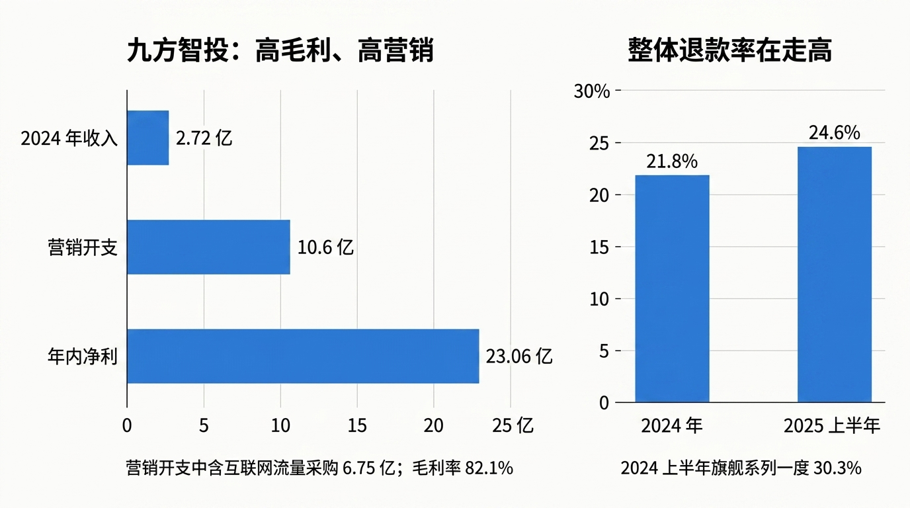

# 投资 AI Agent：目前最确定赚钱的，还是卖工具的人

> **TL;DR**：把真钱交给 AI 的公开实验证明它能赚，但不稳定——Nof1 两季冠军分别是 Qwen3-Max（+22.32%）和 Grok 4.2，港大外汇实验 Qwen +9.9% 而 DeepSeek -15.1%，同样的 DeepSeek 在美股纳指实验里又拿第一，冠军随市场更换，正收益窗口普遍只有 2～6 周。大样本更差：IC3 审计的 11 个 Solana agent 金库、92.5 万持有者合计亏掉 1.917 亿美元，收益的 81.4% 流向 top 1% 钱包，中位用户为负。真正跑通的是卖工具：券商佣金、投顾服务费（九方智投毛利率 82.1%）、卖课收入（李一舟一年约 5000 万）都有财报级证据；而知名开源回测框架 TradingAgents 被确认存在 look-ahead bug，中美监管也都没有覆盖 agent 交易。以后看到一个号称能赚钱的投资 agent，先回答五个问题：回测还是实盘？跑了多久、跨没跨市场环境？扣没扣手续费和滑点？冠军账户还是中位收益？平台敢不敢公布用户盈亏分布？

2026 年，AI agent 已经开始真正接管交易账户。

Robinhood 开放接口，让第三方 agent 可以直接下单；Coinbase 推出面向 agent 的支付和交易基础设施；国内券商也在把 AI 投顾、T+0 算法塞进交易 App。另一边，加密市场炒过一轮 agent token，社交媒体上“把 100 万交给 DeepSeek 炒股”之类的内容也越来越多。

问题不是 AI 能不能分析股票，而是更直接的一件事：**把真钱交给 AI，它到底能不能持续赚钱？**

这个问题不能只看几个漂亮的回测。投资 AI agent 的证据大致可以分成三层：回测、真实资金实验，以及真正商业化以后普通用户的收益。越往后，证据越有价值，也越难找到。

目前公开数据呈现出的情况很有意思：AI 偶尔确实能赚到钱，但冠军不断更换，跨市场稳定性很差；到了几十万用户规模的 agent token 市场，中位用户反而在亏钱。与此同时，平台佣金、投顾服务费和卖课收入，却都有非常清楚的现金流。

## 真钱交给 AI：能赢，但赢得并不稳定

目前最值得看的不是回测，而是直接拿真钱运行模型的实验。

Nof1 Alpha Arena 第一季从 2025 年 10 月 18 日跑到 11 月 3 日，6 个模型各拿 $10,000，在 Hyperliquid 上交易永续合约，全程使用真实资金。最终 Qwen3-Max 收益 +22.32%，DeepSeek V3.1 +4.89%，其余模型全部亏损，GPT-5 亏掉 62.66%。这些结果不仅有 [SCMP 的报道](https://www.scmp.com/tech/tech-trends/article/3331425/alibabas-ai-model-outperforms-us-rivals-crypto-trading-showdown)，交易本身也可以通过公开钱包核对。

这个实验最重要的地方不是 Qwen 赢了，而是 Nof1 自己对结果非常克制。官方明确说这是“真实交易，而不是回放或纸面练习”，但同时提醒，早期成功完全可能只是运气，[他们并不预期任何模型天然擅长交易](https://nof1.ai/blog/TechPost1)。

第二季把实验扩大到 8 个模型、32 组策略，每组仍然是 $10,000，总资金 $320,000，市场换成美股权益代币。结果只有 6 组盈利，而且全部来自 Grok 4.2。更反常的是，各组交易胜率普遍都在 70%～89%，但胜率和最终收益几乎没有关系。真正拉开结果的是持仓时间：Grok 4.2 的平均持仓明显更长，而多数模型不到两小时。相关结果可以在 [Nof1](https://nof1.ai) 和实验参与者的[复盘](https://www.linkedin.com/posts/victor-zhorin_in-late-2025-nof1-ran-alpha-arena-season-activity-7458491378105315328-gElz)中看到。

港大的实验给出了类似结果。2026 年 4 月，港大经管学院启动 AIEL Agentic Trader，让 10 个模型各拿 $10 万进行 6 周实时外汇交易，不预设策略。最终 Qwen +9.9%，DeepSeek -15.1%，交易超过 1000 次的高频模型也没有因此获得更高收益。校方因此只把结果定义为[“特定市场环境下的阶段性表现”](https://www.hku.hk/press/press-releases/detail/c_29241.html)。

但在另一个市场里，排名马上反了过来。HKUDS 的 [AI-Trader](https://github.com/HKUDS/AI-Trader) 用各 $1 万交易纳指 100 成分股时，DeepSeek 反而以 +10.61% 排名第一。同一个模型，在美股实验里最好，在外汇实验里却最差。

这几场实验至少证明了一件事：**AI 可以在某一段市场环境里赚钱，但目前没有证据证明某个模型拥有可以跨市场、跨周期复现的稳定 alpha。**

样本窗口也是一个明显限制。这批正面结果基本都来自 2～6 周的短期实验。几周跑赢市场，可以说明模型具有交易能力，却远远不足以证明它形成了一套稳定的投资系统。

一个更小但很典型的案例来自 Nathan Smith。他用 $100 真实资金运行 AI 组合 6 个月，最初四周表现不错，但随后核心仓位 AYTR 单日暴跌 83%，整个组合[此后再也没有恢复](https://blog.flatcircle.ai/p/ai-trading-arenas)。这个案例甚至不是 AI 不会选股票，而是更传统的问题：仓位过度集中，最终一次风险事件就足以抹掉之前所有收益。

AI 没有绕过投资里最基本的事情——市场环境、仓位、风险控制和交易成本，仍然比“用了哪个模型”更重要。

## Agent token：92 万持有者，合计亏掉 1.9 亿美元

真钱实验的问题是样本太小。如果想看大规模用户真实赚没赚钱，目前最有价值的数据反而来自加密市场。

IC3 的研究 [Paper Agents, Paper Gains](https://arxiv.org/abs/2605.29174) 审计了 11 个 Solana agent 金库，覆盖 925,323 个持有者，时间跨度从 2024 年 10 月到 2025 年 11 月。

结果非常极端：这些 agent 金库账面浮盈超过 $30M，但持有者合计亏损 $191.7M。用户累计收益一度达到约 $2.4B，随后全部回吐并转成净亏损。收益分布也高度集中，top 1% 的钱包拿走了 81.4% 的收益，而每个平台的中位用户收益都是负数。

Token 本身的表现同样不好。样本中的 agent token 相比历史高点平均下跌约 93%，同期 SOL 的回撤是 54%。研究还发现，大量所谓 agent 实际上并没有进行自主交易，17,000 多个启动量中的多数只是简单 API integration。

明星项目也没有改变这个结果。ai16z 后来更名为 elizaOS，经历 token 迁移之后，2026 年 8 月项目方与集体诉讼达成和解，创始人宣布 token “dead”，价格较峰值跌幅超过 97%；VIRTUAL 较历史高点也一度下跌约 89%。

这批数据并不能代表所有 AI agent，更不能直接证明未来的 agent token 都会亏钱。但它至少提供了一个目前少见的大样本用户账本：**项目账面赚钱、少数早期钱包赚钱，不等于普通持有者赚钱。**

这是讨论 AI 投资时很容易被忽略的一层。媒体通常展示收益最高的模型、最成功的钱包或者最漂亮的一条收益曲线，而投资者真正应该看的，是整个用户分布的中位数。

## Agent 越来越火，但平台没有公布用户到底赚了多少

如果 AI agent 的盈利能力还没有被证明，为什么券商和交易平台仍然在快速接入？

原因并不复杂。对平台来说，AI 是否产生稳定 alpha 和 AI 是否能成为一门生意，本来就是两个问题。

Robinhood 在 2026 年 5 月 27 日开放 Agentic Trading beta，通过 MCP 和独立预算账户，让第三方 AI agent 可以直接操作交易。官方说明甚至明确写着，交易可能在用户没有直接输入的情况下由 agent 执行。

与此同时，它的[风险条款](https://robinhood.com/us/en/agentic-trading)也非常明确：Robinhood 不保证 agent 输出的准确性或适用性，不负责 agent 决策带来的投资损失，并提醒用户可能损失全部投资。换句话说，平台提供的是交易基础设施，而不是收益保证。

上线后的用户数和交易量主要来自公司自己的披露，目前也没有看到 Robinhood 在财报里单独公布 agentic 用户的平均收益、盈亏比例或风险调整后回报。真正独立的实测非常少，NexusTrade 创始人 Austin Starks 体验后亏了约 $5，还遇到了模拟盘缺失、OAuth 回调异常等问题，最后把它评价为[“一个半成品 API 发布伪装成人工智能”](https://medium.com/@austin-starks/i-just-tried-robinhoods-alleged-agentic-trading-i-am-not-impressed-33d3725a23e0)。

eToro 的 Tori 也类似。平台宣传首年完成约 50 万笔交易，但官方财报没有单独披露 Tori 用户的收益数据，同时明确声明 “Tori does not provide investment advice”。

Coinbase 的模式更加直接。2026 年 6 月上线 Coinbase for Agents 后，收入来源包括交易费、USDC 结算价差以及 Base 链上的交易活动。这里商业逻辑和传统交易平台没有本质区别：agent 交易越频繁，基础设施使用量越大，平台越容易赚钱。

国内券商也在走类似路线。34 家上市券商 2025 年 IT 投入合计 275.88 亿元，同比增长 12.96%，约占总营收 6.2%，AI 已经成为券商基础设施投入的一部分。[财联社的数据](https://m.cls.cn/detail/2365785)至少说明，这不是概念 Demo，而是真金白银的 IT 投资。

华泰的 AI 涨乐、SmarT T+0，国泰海通的君弘灵犀都已经进入真实产品。问题仍然是用户收益数据很少。SmarT T+0 市场销售中出现过“胜率约 70%”的说法，但没有独立账本验证；佣金却很清楚，T+0 交易大约万 3～3.5，普通交易约万 1。交易频率上升以后，平台收入天然跟着上升。

关于用户实际结果，目前能引用的只是记者采访。例如 2026 年 6 月的一篇[报道](https://www.21jingji.com/article/20260608/herald/1fc0517d78684d3ed05f32a075a4646e.html)综合多位客户经理后给出盈利与亏损约 7:3，但没有公开账本，同篇文章中也存在反向的用户体验。

所以现阶段判断这类商业产品，最好把“用户很多”“交易很多”和“用户赚钱”分开看。前两项已经有不少数据，第三项几乎仍是空白。

## 真正已经跑通的，是卖工具的现金流

相比 agent 自己能不能稳定赚钱，卖工具这一侧的数据完整得多。

九方智投是一个很典型的样本。根据其[2024 年报](https://www1.hkexnews.hk/listedco/listconews/sehk/2025/0327/2025032701708_c.pdf)，公司当年收入 23.06 亿元，同比增长 17.3%，毛利率达到 82.1%，净利润 2.72 亿元。营销开支达到 10.6 亿元，其中互联网流量采购就花了 6.75 亿元。

到 2025 年上半年，公司收入进一步达到 21.0 亿元，同比增长 133.79%，归母净利润 8.65 亿元。

与此同时，退款率也很高。2024 年整体退款率为 21.8%，2024 年上半年旗舰系列一度达到 30.3%，2025 年上半年继续升到 24.6%。一个很有意思的对照是，九方自己的金融投资业务在 2024 年亏损了 6408 万元。

这些数字组合在一起，比任何宣传文案都更能解释这门生意：高毛利、高营销投入、高退款率，同时收入快速增长。它的核心商业能力是获客、销售和提供投顾服务，并不要求客户最终必须靠这些工具赚到钱。

监管数据也能看到同一个结构的问题。2025 年 2 月，上海证监局因未登记员工荐股、营销误导等问题责令九方整改；2026 年 2 月处罚进一步升级为责令改正并暂停新增客户 3 个月。行业层面，从 2025 年 11 月以来已有多家投顾机构被处罚，[证券时报的统计](https://stcn.com/article/detail/3636427.html)显示机构数量也有所下降。

这并不是 AI 发明的新商业模式。投顾行业的投诉在 AI 热潮之前已经快速增长，从 2021 年的 6,040 起上升到 2023 年的 23,531 起。AI 更像是给原来的荐股、投顾和课程销售套上了一层新的产品包装。

监管案例里甚至能看到非常直接的做法。深圳证监局 2026 年 6 月发布的[风险提示](https://www.csrc.gov.cn/shenzhen/c105615/c7638512/content.shtml)提到，有所谓“AI 量化选股”软件通过修改历史回测数据制造盈利效果；一些培训机构的荐股信息实际上直接由免费 AI 生成；还有产品通过远程云桌面控制所谓的量化设备。

卖课市场的收入同样是真实的。李一舟的 AI 课程一年售出约 25 万套、销售额约 5000 万元；“DeepSeek 炒股收益率 1281.82%”之类的内容也大量出现。相关调查可以参考[虎嗅](https://m.huxiu.com/article/4119755.html)和[第一财经](https://www.yicai.com/news/102505405.html)。

这里最值得区分的是商业模式：投资者只有交易判断正确才能赚钱，而平台、投顾和课程公司只要完成交易或销售，就可以先产生收入。

这导致双方天然处在完全不同的收益结构里。

## 回测为什么总比实盘漂亮

投资 AI agent 最容易制造错觉的地方还是回测。

TradingAgents 是目前最知名的开源 LLM 交易框架之一，由 UCLA、MIT 等研究者参与，GitHub 有大量关注。它公布过非常漂亮的结果：2024 年 1 月 1 日到 3 月 29 日，测试 AAPL、GOOGL、AMZN 三只股票，Sharpe 达到 8.21。

问题是，这个结果只有三个月、三只股票，而且测试区间本身就很少出现明显回撤。更严重的是，项目后来确认存在 look-ahead bug：Alpha Vantage 返回的财报数据绕过了原有过滤逻辑，让未来日期的数据进入历史回测，相当于模型在某些情况下提前看到了未来。

项目自己的 README 后来也提醒，历史回测可能混入实时新闻，因此重新运行的结果不保证与论文数字一致。另一个 issue 还发现，论文声称情绪 agent 可以使用 Reddit/X 数据，但实际代码一度只有 Yahoo Finance 的新闻流。项目主页和相关说明可以从 [TradingAgents](https://tradingagents-ai.github.io) 继续追。

这类问题不是 TradingAgents 独有。2026 年 5 月的一篇[研究](https://arxiv.org/abs/2605.16895)同时分析 FinCon、FinMem、TradingAgents、FinAgent、QuantAgent、FLAG-Trader 等多个框架，结论是：端到端 LLM trading agent 报告出的 alpha，不应该直接被当成可部署证据。

更底层的问题来自模型行为本身。[相关研究](https://arxiv.org/abs/2409.11540)发现，LLM 在金融预测中容易过度外推趋势并产生系统性乐观偏差，而且简单提示工程并不能彻底消除。多个模型又共享相似的训练语料和基础架构，因此当越来越多 agent 同时参与市场时，还可能形成策略同质化。

当然，这不意味着 AI 在投资里没有价值。Chen、Kelly、Xiu 的[新闻嵌入研究](https://papers.ssrn.com/sol3/Papers.cfm?abstract_id=4416687)获得过很高的多空组合 Sharpe，说明语言模型确实可能从非结构化金融信息中提取有效信号。

但这里的前提是机构级新闻数据、严格的方法设计和专业交易基础设施，而且结果还是扣除实际交易成本之前。

它证明的是“LLM 可以成为量化研究工具”，不是“给散户一个聊天机器人，它就能稳定替你赚钱”。

## 监管也还没有准备好

AI agent 直接操作证券账户之后，还有一个以前没有的问题：机器做错交易，到底谁负责？

截至目前，中美都还没有专门针对 AI agent 交易建立完整规则。

美国这边，2026 年 6 月 23 日，8 名民主党众议员致信 SEC，直接询问第三方 AI agent 是否需要承担券商监管、Reg BI、记录保存或受托义务。国会议员的表述是，这些公司目前很大程度上[运行在现有证券监管框架之外](https://foster.house.gov/media/press-releases/foster-sherman-seek-regulatory-clarity-agentic-ai-trading)。

FINRA 的 2026 年监管报告第一次专门讨论 AI agents，但基本原则仍然是技术中立：即使建议或决策受到 GenAI 影响，金融机构仍然需要为相关行为负责。目前并没有一套独立的“AI agent 交易牌照”。

中国的方向类似。中证协讨论的是分级准入、算法登记、持续测试和责任链条，金融监管部门对资金交易等 AI 应用的基本原则仍然是“谁使用谁负责”。

真正发生纠纷以后，用户追责也不容易。北京互联网法院 2026 年 1 月的一起生成式 AI 案件明确认为，AI 本身不是民事主体，生成式 AI 属于服务而非产品，服务商通常承担过错责任，而且对准确性承担的是方式义务，不是结果保证。[人民网对案件的报道](http://society.people.com.cn/n1/2026/0126/c1008-40652440.html)可以看到这个判断。

金融交易如果沿着类似思路发展，会出现一个很现实的结构：agent 可以替用户自动做决定，但最终投资损失未必能轻易转嫁给模型提供商。

这也解释了为什么 Robinhood、eToro 和国内券商的免责声明都写得非常谨慎。

## 所以，投资 AI Agent 到底能不能赚钱？

现有证据还不足以回答“不能”，但也远远支撑不了“可以稳定赚钱”。

真实资金实验已经证明，LLM agent 确实可以在某些市场、某些时间窗口获得正收益。问题在于冠军不断变化，同一个模型换个市场甚至可以从第一变成倒数，正收益窗口目前也普遍只有几周。

到了真正的大规模用户数据里，情况反而更差。IC3 跟踪的 92 万多个 agent token 持有者总体亏损 1.917 亿美元，收益高度集中于最早的一小批钱包，中位用户为负。

真正最清楚的数字来自另一边：券商收佣金，交易平台收手续费和价差，投顾公司收服务费，课程公司收学费。这些收入不需要等待 agent 证明自己拥有长期 alpha。

所以标题更准确的理解不是“用 AI 投资一定亏钱”，而是：

**截至目前，卖 AI 投资工具已经有可以从财报和交易结构里验证的商业模式；普通用户依靠这些工具获得稳定超额收益，还没有同等级别的证据。**

以后再看到一个号称能赚钱的投资 agent，可以先看五件事：

1. 展示的是回测、模拟盘，还是真实资金？
2. 实验跑了多久，是否跨过不同市场环境？
3. 收益有没有扣掉手续费、滑点和融资成本？
4. 展示的是冠军账户，还是所有用户的中位收益？
5. 平台敢不敢公布真实用户的长期盈亏分布？

如果这五个问题回答不了，那么它首先应该被当成一个 AI 产品，而不是一套已经被证明有效的投资策略。
