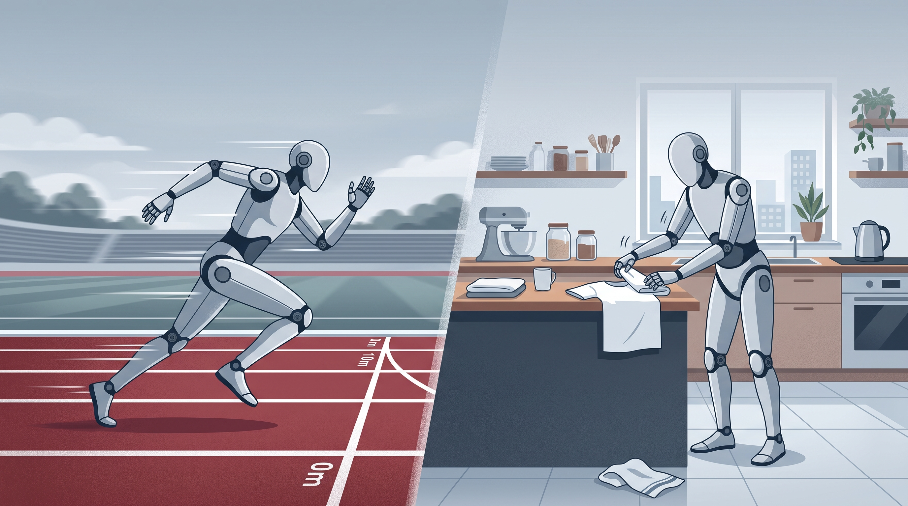

# 具身智能 2026：机器人已经能跑赢人类，为什么还叠不好一件衣服？

> **TL;DR**：机器人已经证明自己能跑、能在工厂和仓库里完成一些重复任务，但这离“在家里自主做家务”还差得很远。真正难的不是让它成功一次，而是在杂乱环境里连续处理柔性物体、长流程和突发情况；今天的家务能力仍多是演示、试点，甚至需要远程人工接管。判断具身智能何时成熟，与其追问“还要几年”，不如看它能否稳定、少监督、低成本地完成真实任务并扩大部署。

2026 年，如果只看公开视频，人形机器人似乎已经快要什么都会了：跑半马、跳街舞、打武术、盘核桃、叠衣服，甚至开始进入汽车厂和物流仓库。

春晚上，银河通用 Galbot 和沈腾、马丽同台完成盘核桃、捡玻璃碎片、货架取货、叠衣服、串烤肠等操作，[科技日报称其为](https://www.stdaily.com/web/gdxw/2026-02/17/content_474989.html)春晚首个能够「全自主决策干活」的机器人。4 月，北京亦庄的人形机器人半马中，荣耀「闪电」以 50 分 26 秒完赛，比人类男子半马 56 分 42 秒的世界纪录还快，[CBS News 也报道了这场比赛](https://www.cbsnews.com/news/humanoid-robot-half-marathon-beijing-human-world-record)。

但如果把问题换成一句更实际的话：**现在真的有机器人能在家做饭、洗衣、洗碗吗？**

答案是，还不能。

截至 2026 年 8 月，具身智能已经证明了很强的运动能力，也开始在工业环境里承担真实任务，但距离稳定、自主完成家务的「机器人保姆」仍然很远。关键原因是：运动控制、物体操作、长流程规划和安全性，并不是同一个难度的问题。

## 家务机器人走到哪一步了

如果把「会做家务」拆成具体任务，现状会清楚很多。

| 任务         | 当前状态    | 能做到什么               | 主要问题               |
| ------------ | ----------- | ------------------------ | ---------------------- |
| 做饭         | 演示 / 试点 | 取食材、微波炉或烤箱加热 | 尚无可信的完整烹饪     |
| 洗衣         | 演示        | 放入、取出洗衣机         | 柔性物体操作不稳定     |
| 洗碗         | 演示        | 清桌、装洗碗机           | 没有完整清洗和收纳闭环 |
| 叠衣服       | 演示        | 折预先摆好的衣物         | 输入和环境高度受控     |
| 完整家务流程 | 小规模试点  | 多项任务串联             | 速度慢、稳定性不足     |

先看做饭。武汉拾光 S1 的早餐流程主要是使用微波炉加热；LG CLOiD 在 CES 上把牛角包放进烤箱，但[CNET 记者现场注意到](https://www.cnet.com/home/kitchen-and-household/lg-brought-a-robot-that-cooks-folds-laundry-and-empties-the-dishwasher-to-ces)，演示过程中烤箱门甚至没有关上。1X NEO 目前公开的厨房能力，也更多是识别食材、建议菜谱和取放物品。

因此，今天厂商说的「做饭」，通常还是拿食材、放进设备、加热、取出。真正涉及切菜、翻炒、火候控制和异常处理的完整烹饪，还没有可信的公开案例。

洗衣更难。2025 年 9 月，TIME 记者现场观看 Figure 03 把衣服放进洗衣机，[机器人前两次都把衣服掉到了地上](https://time.com/7324233/figure-03-robot-humanoid-reveal)，第三次才成功。问题并不是机器人完全不会，而是家庭需要的不是「成功一次」，而是长期稳定。

洗碗稍微靠前一些。Figure 03 已经能清理餐桌并把餐具装进洗碗机，但这仍然不等于完成清洗、擦干和收纳。Figure CEO Brett Adcock 当时自己也说：“We're not there yet.”

叠衣服同样容易被 Demo 高估。LG CLOiD 确实能折衣服，但[CNET 的评价](https://www.cnet.com/home/kitchen-and-household/lg-brought-a-robot-that-cooks-folds-laundry-and-empties-the-dishwasher-to-ces)是 “somewhat sloppily”，而且毛巾是工作人员提前摆好的。[Engadget 因此把整场展示称为](https://www.engadget.com/home/smart-home/lgs-cloid-robot-can-fold-laundry-and-serve-food-very-slowly-181902306.html)一次「精心编排的 15 分钟演示」。The Verge 在 CES 专门测试机器人洗衣服，[最后也认为](https://www.theverge.com/featured-video/860104/we-tried-to-get-humanoid-robots-to-do-the-laundry)整个行业仍然卡在 Demo Mode。

真正的问题已经不是「机器人有没有做过」，而是：**连续做多少次还能成功，环境变化后还能不能做，以及中间要不要人接管。**

## 武汉拾光 S1：少数进入真实住宅的案例

目前比较接近真实家庭场景的是武汉拾光 S1。

它是轮式机器人，不是双足。5 月发布后进入光谷之寓人才公寓测试，[湖北日报此前报道](https://news.hubeidaily.net/pc/c_5599535.html)，项目计划开放 100 台免费家庭试用。

在约 150 平方米户型里，S1 可以串联完成取物、微波炉加热、清理餐桌、洗碗、取衣、叠衣和收纳等任务。厂商称完整流程最快约 7～8 分钟。

6 月 8 日，[湖北日报记者进行了现场测试](https://news.hubeidaily.net/pc/c_5613011.html)：早餐流程约 8 分钟，动作明显比人慢，但逻辑连贯；如果有人挡路或物品被挪走，机器人还能重新规划路径。

这已经比发布会 Demo 更进一步，但厂商自己也承认，它还无法完全胜任「家庭保姆」。而且试点时间表仍存在不同口径，截至 8 月初也没有看到大规模入户的后续报道。

所以，S1 更适合被定义为**真实住宅试点**，而不是已经成熟的家务机器人。

## “家务失败率 88%”其实被误读了

网上经常出现一个数字：机器人做家务失败率高达 88%。

它并不是直接测出来的。

这个说法来自 Stanford 2026 AI Index Report 中「成功率约 12%」的数据，再由媒体用 100% 减去 12% 得到 88%。

更重要的是，这个 12% 不是现实家庭数据，而是来自 2025 年 BEHAVIOR Challenge 的仿真测试。比赛选取 50 个长时程家务任务，最好团队的完整成功率约为 12.4%，相关数据可以在[Stanford AI Index 2026 技术章节](https://hai.stanford.edu/assets/files/ai_index_report_2026_chapter_2_technical.pdf)中找到。

因此，准确的说法应该是：

> **在仿真环境的长时程家务 benchmark 上，目前最好系统的完整任务成功率约为 12.4%。**

真实家庭中的失败率是多少？目前没人知道，因为机器人还没有形成足够大的真实家庭部署样本。

而且从仿真迁移到真机后，表现通常会进一步下降。BEHAVIOR-1K 的测试中，带人类输入辅助的真机系统成功率约为 22%，完全自主学习的方法甚至是 0%，而仿真中能达到约 40%。

这就是 Sim-to-Real Gap：在模拟器里能做，不代表现实里也能做。

## 为什么机器人能跑半马，却叠不好衣服？

因为运动和操作是两类完全不同的问题。

跑步、跳跃、保持平衡主要处理机器人自身的动力学，包括重心、惯性、关节控制和落脚点。这些问题虽然很难，但物理规律明确，而且强化学习、仿真训练和 Sim-to-Real 已经积累多年。

家务则要求机器人不断处理不可预测的外部环境。衣服会随机变形，杯子会滑，每家的厨房布局不同，同一张桌子的摆放每天也不同。

家庭场景一次性集中了四个难题：

**非结构化环境、柔性物体、长时程任务和低容错。**

尤其是长时程任务。假设机器人单步成功率已经达到 99%，连续完成 50 个步骤，整体成功率也只有：

`0.99^50 ≈ 60.5%`

如果单步成功率是 95%，则只剩：

`0.95^50 ≈ 7.7%`

所以，「能抓起一个杯子」和「能独立收拾完整个厨房」之间，不只是多几个动作，而是误差会沿着任务链不断累积。

很早以前，IEEE Spectrum 就记录过 PR2 做家务的实验：机器人完成一顿早餐相关任务需要约 90 分钟，清理任务 5 次失败 2 次。[这类实验](https://spectrum.ieee.org/hard-for-robots-autonomous-household-chores)至今仍然能解释家庭机器人为什么这么难。

## 现在卡住机器人的，主要是数据和操作能力

当前具身智能越来越依赖 VLA，也就是 Vision-Language-Action 模型，把「看到什么」「用户要什么」和「下一步怎么动」放进一个模型里学习。

问题是机器人数据非常难收集。

语言模型可以直接使用互联网文本，但机器人动作数据通常需要真人遥操作，一遍遍完成拿杯子、开冰箱、折衣服、装洗碗机等任务。每条数据都需要真实时间，而且不同机器人本体和机械手的数据未必能直接复用。

互联网视频虽然很多，却没有精确的机器人动作标签。你能看到一个人叠衣服，却不知道每根手指用了多少力、关节什么时候移动。

这也是为什么遥操作现在既是补救手段，也是数据采集方式。

控制频率反而已经进步很快。早期 RT-2 通常只有 1～3Hz，π0 提高到 50Hz，π0-FAST 已经可以达到 200Hz。真正困难的问题逐渐变成：机器人有没有看懂物体、应该抓哪里、抓多大力、失败后能不能恢复，以及在人旁边工作是否安全。

[State of Robotics 2026](https://www.roboticscenter.ai/state-of-robotics-2026)仍然把灵巧手操作列为实际机器人学最重要的未解决问题之一。

所以，「机器人只会跳舞」只说对了一半。它低估了运动控制的真实进步，但如果因此判断机器人马上就能做饭洗衣，又明显高估了操作能力。

## 真正在干活的机器人，还在工厂和仓库

如果家务机器人还主要是 Demo 和试点，那么已经生产出来的上万台机器人去了哪里？

主要是工厂和仓库。

Figure 和 BMW 的合作是典型案例。两台 Figure 02 在 BMW Spartanburg 工厂执行钣金上料任务，累计装载超过 90,000 个零件、运行超过 1,250 小时。合作期间相关产线下线超过 30,000 辆 BMW X3。

这里需要注意措辞：机器人是**参与生产**，不是「生产了 3 万辆 BMW」。Figure 和[BMW 官方新闻稿](https://www.press.bmwgroup.com/global/article/detail/T0455864EN/bmw-group-to-deploy-humanoid-robots-in-production-in-germany-for-the-first-time?language=en)在这一点上的口径基本一致。

Agility Robotics 的 Digit 则已经在 GXO 仓库累计搬运超过 100,000 个周转箱。

仓库和工厂之所以更容易商业化，是因为环境相对标准：地面平整、路线固定、物品规范、任务重复，而且企业可以直接计算在线率、吞吐量、错误率和人工成本。

中国厂商也已经进入万台级。按 Omdia 估算，智元机器人 2025 年出货约 5,168 台；2026 年 6 月 28 日，智元宣布第 15,000 台机器人下线。银河通用 Galbot S1 也已经进入宁德时代产线。

不同机构对行业总量统计并不一致，但方向很明确：**出货量正在快速增加，真正规模化的需求主要来自工业，而不是家庭。**

原因很简单。家庭最难的四件事是非结构化环境、柔性物体、长流程和低容错，而工厂恰好可以砍掉其中的大部分。

## 普通消费者现在能买到什么？

目前可以买到机器人，但很难买到真正意义上的「机器人保姆」。

家庭定位最明确的是 1X NEO。[1X 官网](https://www.1x.tech/discover/neo-home-robot)给出的早鸟价格是 20,000 美元，也可以选择 499 美元/月订阅。

但 NEO 最关键的功能不是硬件，而是 Expert Mode：当机器人不会完成某项家务时，用户可以预约 1X Expert 远程接管。

换句话说，现阶段的 NEO 更接近：

**机器人硬件 + AI 模型 + 云端远程人工。**

1X CEO Bernt Børnich 也公开表示，早期很多任务会由遥操作员完成，[Engadget 对这套模式有完整介绍](https://www.engadget.com/ai/1x-neo-is-a-20000-home-robot-that-will-learn-chores-via-teleoperation-040252200.html)。

实测同样如此。WSJ 记者 Joanna Stern 测试 NEO 时，冰箱取瓶、装碗和整理等操作实际上由另一个房间里戴 VR 头显的人完成，[现场视频](https://www.youtube.com/watch?v=f3c4mQty_so)展示了这一过程。Wired 后来询问 1X，公司也承认公开内容里既有自主运行，也有人工操控的视频，[用于展示硬件能力上限](https://www.wired.com/story/the-1x-neo-robot-has-freaky-fast-fingers/)。

截至 2026 年 7 月 16 日，[RoboZaps 的审计](https://blog.robozaps.com/b/1x-neo-review)仍没有找到经过核实的消费者实际交付案例。

宇树 G1 虽然起售价约 16,000 美元，但本质上是开发平台，并不是买回家就能干活的家电。[The Robot Report 的产品报道](https://www.therobotreport.com/unitree-robotics-unveils-g1-humanoid-for-16k)显示，EDU 和灵巧手版本价格还会明显更高。

因此，目前消费者可以买到的是机器人硬件、开发平台和部分机器人服务，而不是成熟的通用家务机器人。

## 与其问“还有几年”，不如看它过了几道门

关于家务机器人什么时候成熟，厂商和学者给出的时间差异很大。

2026 年博鳌论坛的一场讨论里，[商汤王晓刚判断约 2 年，宇树王兴兴给出两三年，星动纪元陈建宇认为约 5 年](https://www.guancha.cn/xiongyoujun/2026_03_27_811581.shtml)；而 vivo 邵浩和清华赵明国都倾向于 10 年左右。百度沈抖的说法可能更接近现实：具身智能未必存在一个明确的 ChatGPT 时刻，进步可能是渐进式的。

比时间预测更有意义的是看验证指标。RoboZaps 提出的 [“Gates, not years”](https://blog.robozaps.com/b/future-of-humanoid-robots) 可以归纳成六个问题：

1. **可重复性**：换环境后还能不能稳定完成；
2. **人工监督**：多少任务需要遥操作和人工接管；
3. **续航**：一轮到底能工作多久；
4. **安全**：有没有力限制、急停和事故响应；
5. **经济性**：算上维护、支持、保险和人工以后到底多少钱；
6. **规模**：十台跑得好以后，一万台还能不能成立。

这六个问题，比「两年后是不是 AGI 机器人」更接近产品真实。

## 2026 年真正发生的变化，是机器人开始被验证了

如果把具身智能简单分成「会」和「不会」，很容易走到两个极端：一边认为机器人只会跳舞，另一边认为两三年后机器人就能包办所有家务。

目前的证据都不支持这两个判断。

更准确的状态是：

运动控制已经很强；工业场景开始从 Demo 走向真实部署；精细操作在快速进步，但稳定性仍明显落后；家庭环境则主要停留在展示、媒体实测、小规模试点、消费者预购，以及「机器人 + 远程人工」的混合模式。

所以，机器人到底能不能做饭洗衣，取决于你怎么定义「能」。

如果标准是发布会上成功完成一次动作，那么很多机器人已经能了。

如果标准是普通消费者可以买一台放进家里，它每天自主、安全、稳定地做饭、洗衣、洗碗、叠衣服，不依赖工程师和远程操作员，那么截至 2026 年 8 月，答案仍然是否定的。

目前最接近真实住宅工作的，是武汉拾光 S1 这类试点；最接近消费产品的是 1X NEO，但它仍明确保留 Expert Mode。工业场景则已经走得远得多：Figure 在 BMW 按零件计数，Digit 在 GXO 按周转箱计数，中国厂商开始按千台、万台计算产量。

这可能才是 2026 年具身智能最重要的分界线：

> **工厂已经开始问「机器人一天能干多少活」，家庭还在问「这个 Demo 到底是不是自主的」。**

2026 年还不是家务机器人真正成熟的一年，但它可能是一个更重要的节点：**机器人开始从「看起来很厉害」，进入「必须拿真实运行数据证明自己能干活」的阶段。**
