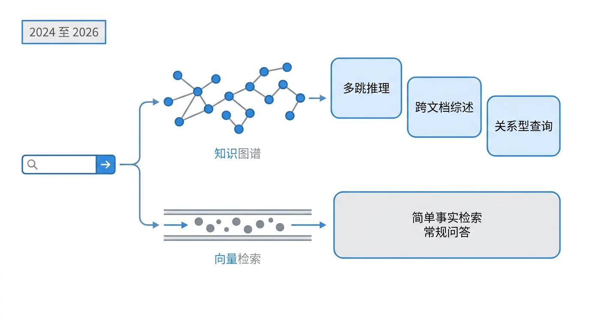
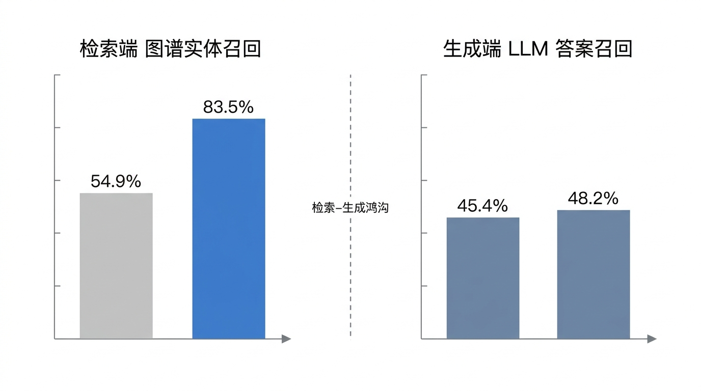

# GraphRAG 两年后：还在维护，但大多数场景用不上

两年前的 2024 年 7 月，微软发布 GraphRAG：把文档先抽成实体和关系的图谱，再在图上检索作答，当年 11 月开源。它很快被当成「RAG 的下一代」，流行的说法是全面更好、什么查询都能答。

2026 年 8 月 6 日，我用 [GitHub API](https://api.github.com/repos/microsoft/graphrag) 核了一遍现状。repo 未归档，最新版 v3.1.1 发布于 7 月 18 日，前一天还有 push。和流行印象对不上的地方更多：stars 只有 35,280，并非中文社区流传的 8 万+；近 52 周只有 84 个 commit，平均每周 1.6 个，其中 2025 年 10 月到 2026 年 1 月有约 3.5 个月零提交空窗；发布由单一维护者主导。版本线两年走完三跳：2024-11 开源并加入 DRIFT 搜索，2025-02 开源 LazyGraphRAG（不建图的模式），2026-01 拆成 8 个包的 monorepo。微软侧的投入信号更弱：[graphrag-accelerator](https://github.com/Azure-Samples/graphrag-accelerator) 已归档，官方 [Agent Framework 的图集成主角是 Neo4j 的 GraphRAG](https://learn.microsoft.com/en-gb/agent-framework/integrations/neo4j-graphrag)，ICLR 2026 接收的相关论文都是外部学术跟进。「微软内部在使用 GraphRAG」这个说法，在论文全文和官方博客里都找不到出处。

第一问「它还活着吗」的答案是：活着，但热度打折，也不是高投入项目。真正要回答的是第二问：它到底值不值得用？

## 它真的更好吗

2024 年的叙事是「GraphRAG 全面更好」。2026 年出现的三个第三方学术基准，把它修正成了一条精确的边界。

简单事实检索上，图是负资产。[GraphRAG-Bench](https://ar5iv.labs.arxiv.org/html/2506.05690)（ICLR 2026）实测，GraphRAG 在 Natural Questions 上比普通 RAG 低 13.4%，时间敏感查询低 16.6%；HotpotQA 多跳只高 4.5%，却付出 2.3 倍的延迟。原因不复杂：图处理对简单查询是冗余，还把噪声带进上下文。

复杂推理和综述是图真正做得好的地方。同一基准里，图家族在复杂推理上大胜（HippoRAG2 53.38 对 Basic RAG 42.93），上下文综述高 12.8 分。两个常见的误读要当心：这些数字的对比对象是 HippoRAG2，微软的 GraphRAG 不在其中；图在简单任务上输的幅度（0.78 分）远小于复杂任务上赢的幅度。

多跳是图最后的堡垒，agentic 检索能逼近但关不掉。[《Do We Still Need GraphRAG?》](https://arxiv.org/abs/2604.09666)（2026-04）给出量化答案：单跳检索下图平均只高 0.47 分，多跳高 27.23 分（HotpotQA 46.70 对 19.00）。即便换成强化学习训练的 agentic 检索 Search-R1，图后端仍大幅领先（MuSiQue 40.82 对 14.42），且方差低约 5 倍。论文的结论是互补，不是替代。

最尖锐的论点来自 AWS 和 Cisco 的[《Is GraphRAG Needed?》](https://arxiv.org/abs/2606.25656)（ACL 2026 GEM Workshop）。他们发现「检索-生成鸿沟」：图谱实体召回从 54.9% 提到 83.5%，翻 1.5 倍，LLM 的答案召回纹丝不动，只在 45.4% 到 48.2% 之间。更颠覆的是，简单的「文档+1 跳关系」方案（Hit@1 0.6972）打败了完整 GraphRAG 管线（0.6422），无工具的自洽 agentic 检索（0.6881）是全场最优，给它加上图谱工具反而降到 0.6055。他们由此把争论从「检索架构」转向「上下文工程」：检索端多捞回来的实体，生成端根本不买账。

一个证据层级的注脚：三个基准都是第三方学术评估，比厂商自报可信，但都没有独立复现；结论基于单一骨干模型（GPT-4o-mini 或 Claude 3.7 Sonnet），论文自己也说结果可能随模型强度变化。

这一节落定的边界是：多跳推理和跨文档综述，图做得好；简单事实检索，图是负资产。关系型查询这第三类，证据来自生产路由实践，后面会看到。

## 赢是有代价的：贵，还难维护

好归好，代价呢。成本是一个范围，不是一个数字。

先看索引。[EMNLP 2025 一篇论文](https://aclanthology.org/2025.findings-emnlp.321.pdf)独立测量，GraphRAG 的索引 token 是 LightRAG 的 1.7 到 2.3 倍。社区流传的「8 倍」「10 到 20 倍」来自配置不同的个案，高配估算可以到 50 到 100 倍。同一个技术，不同配置下差两个数量级，所以「贵 N 倍」必须带配置和语料规模才有意义。

比索引更可复核的是查询。原论文 [Table 3](https://ar5iv.labs.arxiv.org/html/2404.16130) 给出单次全局查询的上下文是 4 万到 114 万 token（News 语料 C0 到 C3 层级）；独立实测 GPT-4o 跑一次约 15 万 token、0.8 美元。

维护痛点是系统性的，官方 issue 链可以完整作证：[#741](https://github.com/microsoft/graphrag/issues/741) 白纸黑字说增量索引是 append-only 设计，删除和修改 out of scope，最坏退化为全量重建；[#511](https://github.com/microsoft/graphrag/discussions/511) 里维护者亲口承认，修改文档等于新增节点，图上可能保留旧事实；[#1702](https://github.com/microsoft/graphrag/issues/1702) 是增量合并后 ID 损坏，查询结果不可用；[#401](https://github.com/microsoft/graphrag/issues/401) 是《福尔摩斯》建图时 Sherlock、Sherlock Holmes、Mr. Holmes 各成独立节点。[社区源码分析](https://juejin.cn/post/7438052532990492710)补上了机制：跨批次实体消歧缺失，按月分批索引时同一实体不合并，实测节点重复率超过 18%、消歧准确率只有 63.2%，社区被迫月度全量重建。从业者吐槽的「调参一个月」是个案，但参数敏感和更新震荡有上述机制独立佐证。

抽取质量有论文级证据。[代码库场景](https://ar5iv.labs.arxiv.org/html/2601.08773)里，31.2% 的文件被 LLM 抽取直接跳过（三个仓库结果一致），图构建时间约 70 倍、端到端成本约 20 到 46 倍，漏检的文件同时从 embedding 和图谱里消失，形成静默盲区。

微软官方的回应是 LazyGraphRAG。[官方博客](https://www.microsoft.com/en-us/research/blog/lazygraphrag-setting-a-new-standard-for-quality-and-cost/)口径是索引成本与 vector RAG 相同、为完整 GraphRAG 的 0.1%，查询成本低 700 倍。但它是官方基准口径，没有第三方复测；查询阶段引入逐查询的 LLM 调用，延迟从毫秒级升到秒级；还没并入主 repo。最接近真实迁移故事的案例是[法律科技客户的 8 万份判例](https://particula.tech/blog/lazygraphrag-700x-cheaper-graphrag-knowledge-graphs)：标准 GraphRAG 索引估算 1.2 万美元，LazyGraphRAG 首查只要分钟级，但那是评估文，还没有长期复盘可看。

## 生产里怎么用

「从研究走向生产」这个说法成立，但公开证据很少。全维度只有一个可信的案例：LinkedIn 客服系统（[SIGIR 2024 论文](https://arxiv.org/abs/2404.17723)，真实生产约 6 个月，带随机对照）。效果数字必须带口径：MRR +77.6% 是相对提升（0.522 到 0.927），BLEU +0.32 是绝对差值（0.057 到 0.377），工单解决时间 -28.6% 是中位数（均值实际 -62.5%）。

其余案例都只有厂商自己的说法。AWS 的医药案例（研发周期 -87%、取中率 5 倍）是匿名单客户试点加[厂商自报](https://aistory.news/generative-ai/aws-graphrag-deployment-slashes-drug-rd-cycles-87)；Neo4j 高管点名 Uber、Klarna、Novo Nordisk 等客户，没有指标细节；AISO 正畸是中文社区里少见的具名私有化部署，但渠道是厂商侧社区，效果数字不能单独引用。流传的「6% 幻觉减少、80% token 减少」出自 [GenAIK 2025 论文](https://aclanthology.org/2025.genaik-1.6/)在 Finance Bench 上的结果属于基准测试，而非生产数据，同论文在另一任务上报出 734 倍 token 降幅，效果数字随任务集跨两个数量级。

不过生产架构模式反而是最扎实的部分，多源一致地沉淀出三个模式。

混合路由。每次查询先判断走 vector 还是 graph，简单查询走 vector、复杂查询走 agentic、关系型查询走 graph。[从业者的年度复盘](https://jacar.es/en/enterprise-graphrag-patterns-after-a-year-of-adoption/)把它称为「最常见也最稳」的做法，不整体迁移。

分层抽取。小模型抽实体，前沿模型按需做综述，把索引成本压住。

联邦图。各域维护自己的 schema，公共实体用上层图桥接，组织重组时不重灌数据。

还有一个实用的入场门槛共识：如果你无法向人解释语料库最重要的五种实体类型，就不适合上 GraphRAG。

## 风险与替代

批评最狠的来自微软自己：LazyGraphRAG 的基准把完整 GraphRAG 的索引成本摆到明面上。第三方论文更直白，ICLR 2026 的 GraphRAG-Bench 直接写「GraphRAG 经常在真实任务上不如 vanilla RAG」。从业者共识是 70% 到 90% 的真实查询用朴素或混合 RAG 就够，这个数字来自多篇独立博文，没有单一权威统计。

安全风险是真实且结构性的。[GragPoison](https://arxiv.org/abs/2501.14050) 是黑盒毒化攻击：通过注入关系一次毒化多个查询，成功率最高 98%，这是上限而非均值（IEEE S&P 2026 录用）。[图谱逆向提取研究](https://arxiv.org/abs/2508.17222)给出了一个关键悖论：原始文本泄露可能反而减少，但结构化实体和关系信息更容易被提取。这个方向已经形成攻防论文簇（LogicPoison、后门攻击、HoG-GRAG 防御），是 2026 年活跃的研究前沿。对医疗、法律、金融这类隐私敏感场景，这是选型时必须计入的新增攻击面。

替代者不少，还没有赢家。LightRAG 的 [stars（约 3.8 万）](https://www.star-history.com/hkuds/lightrag/)已经反超微软 repo，但流传的「快 10 倍、省 8 倍 token」查无官方出处，[论文](https://arxiv.org/abs/2410.05779)自报是约 100 倍少的索引 token，而且它的 LLM 裁判评测在混合域反而输给 GraphRAG（48.14% 胜率）。HippoRAG2 走记忆路线，多跳最强，性价比最高（每百万 token 预处理 2.85 美元，对微软版 13.19 美元）。KAG（蚂蚁）走逻辑推理加合规路线，WPS 365 采纳。Graphiti（Zep）做时序图，上了 ThoughtWorks 雷达。各家 benchmark 互不兼容，跨厂排名不可靠，Mem0 自报 93.4% 被第三方复现成 73.8% 是常态。

真正的趋势性替代是 Agentic RAG：用 agent 的推理替代图的隐性结构，成本低、新鲜度好。它唯一关不掉的是多跳差距，前面说过，agentic 检索在图后端面前仍大幅落后。这就是图「最后的堡垒」的含义。

## 两年后怎么选

回到开头的选型问题。两年过去，上不上图已经不需要赌了。

默认不用。事实检索、单跳问答、常规知识库，vector RAG 加好的文档解析加 reranking 就够，算上索引、查询和维护，成本低一两个数量级。[Atlan 给的规则](https://atlan.com/know/what-is-graphrag/)很具体：实体少于 1000 个、关系简单的语料，vector RAG 以十分之一的成本胜出。

按需叠加。语料有密集可命名关系（法律、医疗、金融、代码依赖），查询确实需要多跳或跨文档综述时，用混合路由让简单查询走 vector、复杂查询走 graph，不整体迁移。

避开两个坑。频繁更新的语料不要上：图新鲜度维护是系统性问题，append-only 的增量索引会把旧事实留在图上。无法治理的脏数据不要上：图会把脏数据放大成结构噪声，比向量库更早暴露。

