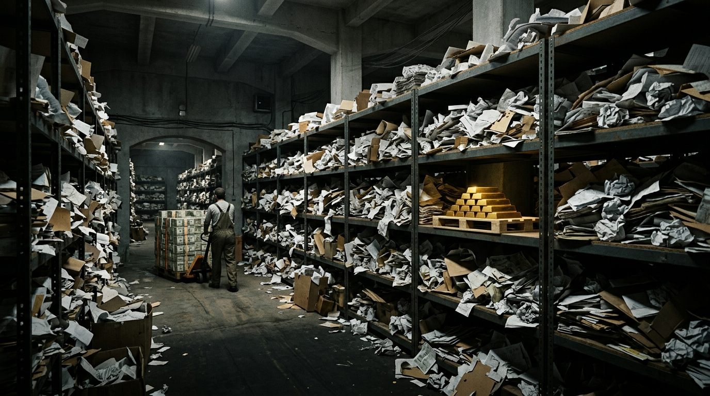

# Mem0 融了 2400 万美元，也存下了 97.8% 的垃圾

> **TL;DR：** Agent 记忆的需求是真的，成本和跨会话价值也是真的，但今天这个市场最缺的不是产品，而是可信的质量验证。一份针对 Mem0 的生产审计发现，32 天存下的 10,134 条记忆中 97.8% 被判定为垃圾；与此同时，融资、云调用量和平台集成都在快速增长。问题不只在 Mem0：厂商自报 benchmark 与独立复现存在明显差距，主流评测本身也受到数据错误、LLM 裁判偏差和上下文窗口膨胀的影响。商业化已经发生，但「什么样的记忆系统真的有效」仍没有稳定答案。

2026 年 3 月 27 日，GitHub 上出现了一份很难忽略的 agent 记忆生产审计。一名开发者在自己的配置中接入 Mem0，连续运行 32 天，再用脚本剔除重复条目，逐条检查剩下的 6,264 条记忆。

结果相当糟糕：这 32 天一共写入 10,134 条记忆（含重复），其中 97.8% 被审计者判定为垃圾。具体看，3,200 条是在复读系统提示词，668 条来自同一个幻觉的反复复制，还有 130 条把 IP 地址、聊天 ID 和文件路径写进了向量库；其余大量内容是心跳日志、已经过期的任务状态和编造出来的用户画像。最终只有 224 条逃过清理，其中 186 条仍然残缺、需要重写，能原样保留的只有 38 条。

几乎同一时期，Mem0 对外展示的是完全不同的商业曲线。2025 年 10 月，公司宣布完成 2,400 万美元融资，Y Combinator、Peak XV 和 GitHub 基金参与；通稿称 AWS 将它选为新 Agent SDK 的独家记忆提供商；云 API 调用量在三个季度内从 3,500 万增长到 1.86 亿——这些调用量均来自厂商披露。GitHub 星标达到 4.1 万，PyPI 下载量突破千万。

一边是快速增长的融资、调用量和平台集成，一边是一份生产环境审计里 97.8% 的垃圾率。真正值得讨论的不是哪个数字更抓眼球，而是两者之间的落差：agent 记忆的商业化速度，已经明显跑在可验证的质量前面。

## 提取才是瓶颈，不是模型

为什么会存进这么多垃圾？这份审计把问题指向了记忆管线最前面的提取环节。

Mem0 的默认流程，是让模型根据一个相对宽松的提示词把对话「总结成记忆」，然后把结果直接写进向量库，中间缺少明确的质量门槛。直觉上，换一个更强的模型似乎应该改善结果，但审计里的实际情况并不是这样：作者在第 21 天把模型从 gemma2 换成 Sonnet，明显的幻觉消失了，可换模型之后最后一批数据的垃圾率也只是从 97.7% 降到 89.6%，全程合计仍然是 97.8%。

模型变得更忠实之后，问题只是换了一种形式：它开始更认真地把系统架构、工具配置和临时任务状态原样保存下来。也就是说，如果「什么值得成为长期记忆」这个判断本身没有做好，模型能力越强，并不会自动把错误的管线设计变正确。

更麻烦的是反馈回路。一条「用户偏好 Vim」的幻觉一旦被写入记忆，下次会话就可能被召回到上下文里；提取模型再把这条已有记忆当成事实重新保存，于是错误开始自我强化。审计里最后出现了 808 条 Vim 偏好，而实际没有人使用 Vim（[issue #4573](https://github.com/mem0ai/mem0/issues/4573)）。

审计者对此的总结是：「换更好的模型只会更忠实地执行宽松的提取提示词，提取提示词才是瓶颈，不是模型。」

这个判断比「模型不够强」更值得警惕。真正的问题不是某一次生成失误，而是整个管线默认缺少过滤与验证。审计者还专门拿 Stanford Generative Agents、LangMem 和 Letta 做对比：这些方案都会在真正存储之前对候选记忆打分，而 Mem0 的默认流程没有这一层。

类似问题也不只出现在这一次审计里。另一位开发者使用 Mem0 商业 API 做了 5 道事实回忆测试，结果全部答错。他的判断很直接：「不是 Mem0 找不到针，是它一开始就没把针放进可搜索的干草堆」（[Medium 实测](https://medium.com/asymptotic-spaghetti-integration/memthe-ai-memory-challenge-part-1-we-asked-mem0-to-remember-five-things-heres-how-it-did-56713c04a3e8)）。还有开发者因为连续被注入三条错误事实，最终撤掉自动提取，退回纯文本摘要（[HN 讨论](https://news.ycombinator.com/item?id=47770220)）。

这些案例不能证明所有 Mem0 部署都会达到 97.8% 的垃圾率，但它们至少指向同一个工程风险：记忆系统最先需要解决的，可能不是检索，而是「什么东西一开始就不该被存进去」。

## 商业信号已经跑在质量验证前面

如果技术质量还没有收敛，为什么融资和平台合作已经这么快？把几家主要公司的进度放在一起看，会发现这个市场目前最强的商业信号，几乎都不是质量信号。

- **Mem0**：完成 2,400 万美元融资（[TechCrunch](https://techcrunch.com/2025/10/28/mem0-raises-24m-from-yc-peak-xv-and-basis-set-to-build-the-memory-layer-for-ai-apps)）。AWS 集成有两个需要分开看的事实：2025 年 7 月，AWS 官方公告确认 Mem0 接入 Neptune Analytics，并在文案中把它称作「self-improving memory layer」（[AWS 公告](https://aws.amazon.com/about-aws/whats-new/2025/07/amazon-neptune-analytics-mem0-graph-native-memory-in-genai-applications)）；但「Agent SDK 独家记忆提供商」这一说法主要来自媒体和 Mem0 自己的通稿，AWS 侧没有对应公告。云调用量的增长数字同样全部来自厂商披露，目前没有第三方审计。
- **Letta**：2024 年 9 月获得 1,000 万美元种子轮融资，由 Felicis 领投（[官方博客](https://www.felicis.com/blog/letta)）。此后没有新的融资信号，产品定位则从「memory platform」逐渐转向「stateful agent platform」。
- **Zep**：公开融资规模是几家公司中最小的，不同来源口径从 50 万到 330 万美元不等。它主要依靠开源时序图引擎 Graphiti 获客，托管服务面向企业市场。官方渠道自述月度 ARR 增长 50%、客户超过 240 家，这些数字同样没有独立验证。
- **Cloudflare**：2026 年 4 月发布 Agent Memory 私有测试版，提供包含提取管线在内的完整托管记忆层，并与 Workers 生态中的 Durable Objects 和 Vectorize 深度绑定，定价至今没有公布（[官方博客](https://blog.cloudflare.com/introducing-agent-memory)）。

融资、开源指标、平台绑定和调用量都在增长，但「记忆质量经过独立验证」这一列基本还是空的。

这不意味着这些商业信号没有价值。它们能证明开发者需求、生态位置和资本预期，却不能直接证明记忆本身的准确性。真正的问题在于，今天连想验证这件事的人，也缺少一把公认的尺子。

## 评测系统本身也不可靠

理论上，benchmark 应该承担这个角色。现实却是，agent 记忆领域的评测结果已经很难直接横向比较。

Mem0 官方文档报告，新算法在 LoCoMo 上达到 92.5 分，在 LongMemEval 上达到 94.4 分（[官方评测页](https://docs.mem0.ai/core-concepts/memory-evaluation)），评测脚本也公开在厂商自己的 [memory-benchmarks](https://github.com/mem0ai/memory-benchmarks) 仓库里。

另一边，一篇第三方论文独立复现开源框架时，LongMemEval 得分只有 49，LoCoMo 为 57.68（[arXiv 2603.04814](https://arxiv.org/html/2603.04814v1)）。

但这里必须先把证据层级和测试口径说清楚。这篇论文来自 Bricks Technology，是公司 preprint，没有经过同行评审，而且只测试了 flat-typed（扁平事实型）一种管线；它复现的是开源框架，并搭配了一个相对便宜的提取模型。Mem0 官方的 92.5 和 94.4 则来自 2026 年 4 月发布的新算法，包含托管平台优化。因此，这两组数字并不是严格意义上的同版本、同配置对照，不能直接把差距全部归因于厂商夸大。

即便退回到更可比的旧算法，差距仍然存在。Mem0 自己公布的旧版成绩是 LoCoMo 71.4、LongMemEval 67.8（[官方博客](https://mem0.ai/blog/ai-memory-benchmarks-in-2026)）；与独立复现相比，同一 benchmark 仍有大约 10 到 19 个百分点的差距。至少从方向上看，目前确实存在一个稳定现象：厂商自报更高，独立复现更低。

更麻烦的是，不同厂商连彼此的测试结果都无法达成一致。Mem0 的论文给 Zep 评出 65.99 分，Zep 自己测试则得到 75.14 分，并声称 Mem0 的配置有误。Zep 还指出，在 Mem0 自己公布的 LoCoMo 数据里，把整段对话直接塞进上下文的 full-context 基线大约能得到 73 分，反而高于 Mem0 最佳配置约 68 分——也就是记忆系统不如直接把全文交给模型（[Zep 博客](https://blog.getzep.com/lies-damn-lies-statistics-is-mem0-really-sota-in-agent-memory/)）。

如果只是厂商之间配置不同，问题还算可控。更严重的是，benchmark 自己也可能有系统性误差。

Penfield Labs 审计 LoCoMo 后报告，6.4% 的标准答案本身存在错误，LLM 裁判会接受 63% 的故意错误答案，56% 的逐类对比在统计上与噪声不可区分。LongMemEval 的 S 版本则可以完整放进现代模型的上下文窗口，因此他们认为：「这是上下文窗口测试，不是记忆测试」（[Penfield 审计](https://penfieldlabs.substack.com/p/proposal-a-new-benchmark-for-long)）。

行业里也有人把问题概括得更直接：现有基准「现在主要是在测你的 LLM 会不会阅读」（[Vectorize Manifesto](https://hindsight.vectorize.io/blog/2026/03/23/agent-memory-benchmark)）。

所以今天看到一个记忆产品拿到 90 多分，真正需要问的不是「高不高」，而是它用了什么版本、什么提取模型、什么上下文预算、谁执行评测、谁充当裁判，以及这个 benchmark 本身到底在测长期记忆，还是模型从一段长文本里找答案的能力。

目前这个领域缺的，正是一套中立、稳定、被普遍接受的评测体系。

## 但记忆层的价值不是假的

如果只看前面的数据，很容易得出「agent 记忆不过是营销」的结论。这个判断同样过头，因为另一侧也存在相当明确的证据：记忆机制本身在一些场景确实有价值。

Mastra 的 Observational Memory 在 LongMemEval 上自报 94.87%，同一张表里的 full-context 只有 60.2%（[Mastra 评测](https://mastra.ai/research/observational-memory)）。不过这里同样要区分证据层级：94.87% 首先是厂商自报，目前只有部分独立复现；而且 Observational Memory 属于「观察式上下文管理」，由两个后台 agent 持续把对话压缩成文本日志，再放回上下文。它并不是 Mem0 这种典型的「提取 → 存储 → 检索」式记忆层。

因此，这个结果更适合证明「记忆或长期上下文管理这个范式有潜力」，而不是证明某一种具体产品已经解决了问题。

成本方面的证据更直接。独立团队 Memori 使用自己的系统在 LoCoMo 上得到 81.95%，平均每次查询只消耗 1,294 token，而直接塞全文需要 26,031 token，差距约 20 倍（[Memori 论文](https://arxiv.org/html/2603.19935)）。Bricks 的论文也做过成本测算：当对话规模达到约 10 万 token 时，大约进行十轮查询之后，记忆系统的累计成本开始低于直接塞全文（[arXiv 2603.04814](https://arxiv.org/html/2603.04814v1)）。

除此之外，跨会话延续、多 agent 共享和数据主权，本来就不是单纯扩大上下文窗口能够完全替代的能力。

甚至那位报告 97.8% 垃圾率的审计者，也没有因此放弃 Mem0。他的说法是：「清理后的 224 条确实有价值，所以我们还在用 Mem0；问题是我们读了 10,134 条才找到 38 条干净的，这不是大多数部署能走的路径。」

这句话可能比任何 benchmark 都更接近当前 agent 记忆的真实状态：价值存在，但信噪比极不稳定，而且市场目前没有成熟机制帮开发者提前判断自己会得到哪一种结果。

## 大厂正在把「够用的记忆」变成平台能力

独立记忆层面对的另一个压力来自模型和云平台本身。2025 年 9 月到 2026 年 6 月，几家大厂陆续把记忆做进自己的平台，基本形成两种路径。

第一种是第一方自建。

Anthropic 的 memory tool 已经 GA，不单独收费，存储后端由开发者自己管理（[官方文档](https://platform.claude.com/docs/en/agents-and-tools/tool-use/memory-tool)）。从产品定价角度看，这相当于把「持久化」这一第三方记忆层最基础的价值压到了零。

微软在 Agent Framework 中也提供了类似的 file-based 记忆：直接用 Markdown 文件存储，随 SDK 提供（[微软博客](https://devblogs.microsoft.com/foundry/memory-build2026)）。Google 则把 Memory Bank 做进 Vertex 平台的计费体系，第三方整理的官方价格为每 1,000 个事件 0.25 美元（[定价整理](https://www.betterclaw.io/blog/google-vertex-ai-agent-builder)）。Cloudflare 的做法更直接，Agent Memory 就内置在 Workers 生态里。

第二种路径是把空间留给第三方。

OpenAI Agent SDK 的长期记忆请求被官方以「不计划实现」关闭（[issue #887](https://github.com/openai/openai-agents-python/issues/887)），因此第三方记忆层仍然有明确的集成空间，Mem0 也成为官方文档化的路径之一。

AWS 的情况更特殊：它本身已经有 Bedrock AgentCore Memory，同时又与 Mem0 做了深度集成。集成本身可以从公开资料确认，但「Agent SDK 独家记忆提供商」这一表述目前主要来自 Mem0 一侧，AWS 没有对应的官方公告。

这两种情况说明，独立记忆层并没有立刻失去市场，但它的位置正在变化：越来越像平台中的一个可替换组件，而不是不可缺少的基础设施。AWS SDK 里的记忆就是一个 `provider` 字段，从产品形态上看，替换供应商并不需要重构整个 agent。

当平台原生方案已经能满足「够用」的记忆需求，第三方就必须证明自己为什么值得额外引入。2026 年的一些主流对比文章，已经把 Claude Code 原生记忆和 Mem0 并列为默认选项（[Vectorize 对比](https://vectorize.io/articles/claude-code-memory-vs-mem0-vs-hindsight)）；Mem0 自己也开始发布「为什么还要用 Mem0」这类文章（[Mem0 博客](https://mem0.ai/blog/claude-code-memory)）。

这意味着竞争重点正在从「有没有长期记忆」转向「第三方记忆究竟能比平台原生方案多提供什么」。

## 两年过去，遗忘仍然没有解决

社区对 agent 记忆的需求其实很少有争议。争议一直集中在实现质量，尤其是一个看起来非常基础、实际上极难的问题：记忆什么时候应该消失。

2024 年 9 月 Mem0 首发时，就有人在 Show HN 里问「有没有遗忘机制」，当时的回答是「计划中」（[Show HN](https://news.ycombinator.com/item?id=41447317)）。到了 2026 年 6 月，新项目 Mnemo 发布时又遇到了同样的问题，回答变成「在 v0.2.0 的路线图上」（[Show HN](https://news.ycombinator.com/item?id=48389586)）。

两年时间过去，遗忘、矛盾检测和时效更新仍然是这个领域反复出现的问题。2026 年 7 月，Mem0 自己的年度状态报告也把 memory staleness 列入最难解决的问题之一（[State of AI Agent Memory 2026](https://mem0.ai/blog/state-of-ai-agent-memory-2026)）。

这类问题之所以重要，是因为长期记忆并不是单纯的「写入更多事实」。旧事实会失效，不同来源会冲突，用户偏好会变化，某些任务状态只在几分钟内有效。如果系统只会不断积累，而不会判断什么应该更新、覆盖或遗忘，那么记忆越多，未必意味着 agent 越了解用户，也可能只是噪声越来越大。

一位开发者在 HN 上把区别说得很清楚：「Mem0 存储记忆，但不学习用户模式。存储事实和从行为中学习是两回事」（[Ask HN](https://news.ycombinator.com/item?id=46891715)）。

也有人干脆质疑复杂记忆基础设施是否必要：「300 行的结构化 markdown 文件就够用了，我想不出数据库能改进什么」（[Reddit 讨论](https://www.reddit.com/r/AI_Agents/comments/1u1hmjq/stop_putting_your_ai_agents_memory_inside_the_llm)）。

这并不意味着 Markdown 一定优于数据库，而是提醒了一个很现实的工程问题：如果一个更复杂的记忆层无法稳定提供比简单文本状态更高的正确率、可控性或成本收益，那么复杂性本身就没有价值。

个人记忆产品已经提供过一次类似的前车之鉴。Rewind 从 2022 年发布 Mac 应用，到 2024 年更名 Limitless、2025 年被 Meta 收购，再到同年 12 月应用永久关停，一个围绕「完美记忆」建立起来的产品周期不到三年（[Rewind 时间线](https://rewind.ai/what-happened-to-rewind)）。

## 结论

今天评估一个 agent 记忆产品，融资额、GitHub 星标、云调用量和平台合作都只能回答「这个市场有没有需求」，不能回答「这套记忆是否可靠」。

更值得看的，是另一组目前很少被公开的数据：写入的记忆里有多少真正值得长期保存，有多少是重复、幻觉、过期状态或系统信息；错误记忆被召回之后会不会继续污染后续写入；旧事实如何更新，冲突如何处理，什么条件下会遗忘；benchmark 是厂商自报还是独立复现，测试配置是否一致，评测本身是否真的需要长期记忆。

Mem0 的 97.8% 不能被外推成整个行业的统一垃圾率，它来自一个具体开发者、具体配置和 32 天生产数据。但它揭示的工程问题是真实的：今天的 agent 已经很容易获得「长期记忆」这个功能，却仍然很难获得一套可以验证其长期正确性的机制。

与此同时，大厂正在把基础记忆能力做进平台，进一步压缩独立记忆层依靠「持久化」本身收费的空间。第三方最终可能只剩下两个更窄、也更难的位置：要么成为平台背后的记忆供应商，类似 Mem0 与 AWS 的合作模式；要么证明自己在跨模型、合规、时序图和更复杂的长期状态管理上，确实能提供平台原生方案没有的价值。

所以真正值得追踪的指标，不是哪家公司下一轮融多少钱，而是谁能把「记住」从一个容易演示的功能，变成一套可审计、可更新、会遗忘，而且独立复现后仍然成立的工程系统。
