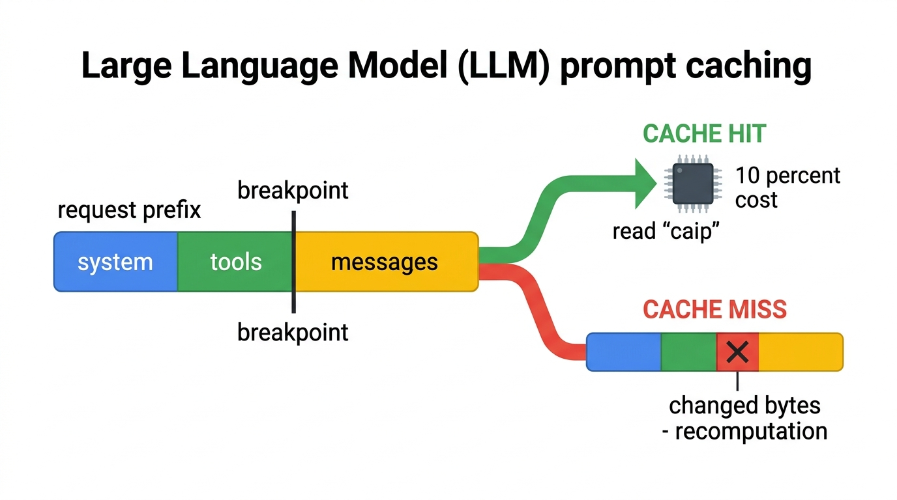
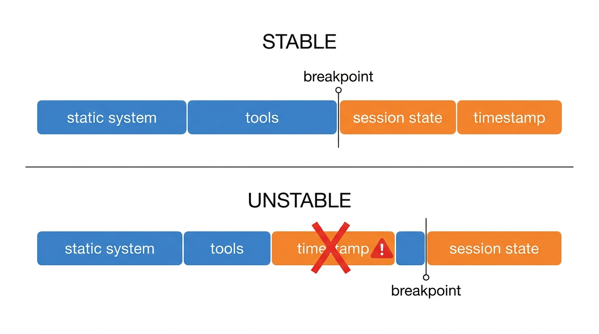
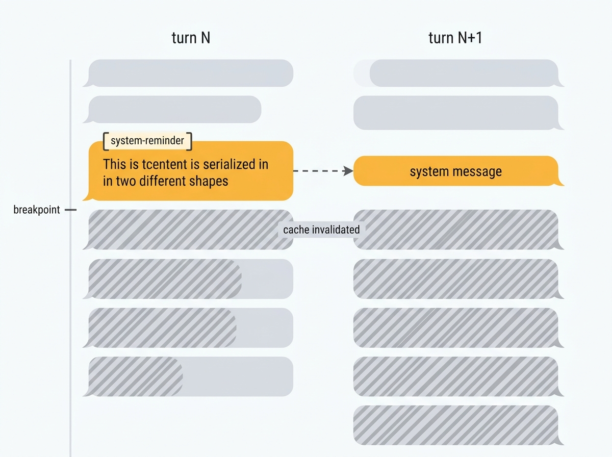

# Prompt Cache 的原理：命中率由前缀稳定决定

同一个模型，两个不同的 agent harness（运行 agent 循环、负责拼装每轮请求的框架或客户端），跑各自的真实会话。Claude Code 每轮请求要携带 6.76 万 token 的上下文，OpenClaw 只带 1.85 万。结果却是带得多的一方几乎不花钱：Claude Code 每轮大约付 2 美分，OpenClaw 付 6 美分（数字来自 [Galileo 的 2026 缓存手册](https://galileo.ai/blog/the-2026-caching-playbook-for-agents-bigger-prompts-smaller-bills)，口径差异后面会说到）。

原因是命中率。Claude Code 的请求里 92.7% 的 token 从缓存读回，每轮只有 296 个 token 需要按原价计算；OpenClaw 每轮 1.85 万 token 里只有 5.2 千是缓存的，1.33 万都是原价。缓存命中率是 agent 成本里最大的杠杆，而它几乎完全不由模型决定，由 harness 决定。

这篇文章讲清楚三件事：缓存机制到底怎么工作，为什么同一个模型下命中率能差出 4 倍，以及你自己写的 agent 怎么不踩同样的坑。

## 先看模型内部：KV cache

Transformer 每生成一个新 token，注意力机制都要重新访问序列里所有 token 的 Key 和 Value 表示，拿当前查询跟它们做加权求和。这些 K/V 表示只由 token 内容决定，不随生成过程改变：同一个请求里生成第 100 个 token 时，前 99 个 token 的 K/V 跟生成第 50 个 token 时一模一样。推理引擎早就把这一笔算账缓存下来复用，叫作 KV cache，这是 Transformer 服务端的基础优化。

Prompt caching 把同一笔账从「一次生成内部」延伸到「多次请求之间」。请求前缀是相同的字节，前缀 token 算出来的 K/V 就相同，服务端可以把前缀的缓存保存几分钟到一小时，下一个请求直接读。所谓命中，就是这份 K/V 没有重算；写入，就是第一次把前缀算进 K/V 并存起来；miss，就是前缀变了，K/V 全部重算。这也顺带解释了为什么写比读贵：写入付的是把前缀编码进模型内部表示的计算费，读取只是把已存的东西取出来（这是 [第三方解释](https://dev.to/rikuq/anthropic-prompt-caching-explained-cachecontrol-markers-the-two-tier-write-premium-and-when-it-25cp)，Anthropic 官方没有公开定价理由）。

## 缓存机制：前缀匹配、断点、定价

明确了模型内部机制，API 层的规则就好懂了。LLM API 的缓存只认一种东西：请求的前缀。缓存保存的是「从请求第一个字节到某个断点为止的完整内容」，下次请求如果前缀和缓存逐字节一致，就命中；只要有一个字节不一样，这一段就全部作废。Anthropic 的官方表述是 "Prompt caching is a prefix match. Any change anywhere in the prefix invalidates everything after it."（[Claude Code 团队博客](https://claude.com/blog/lessons-from-building-claude-code-prompt-caching-is-everything)）。OpenAI 一侧的表述是 "Cache hits are only possible for exact prefix matches within a prompt."（[OpenAI 文档](https://developers.openai.com/api/docs/guides/prompt-caching)）。两家底层规则相同，差别只在控制方式，后面单独说。

命中判定是 hash 判定，不是逐字节滚动比较。Anthropic 的缓存条目是断点前全部字节的累积 hash，一个断点一个条目。hash 已经编码了前缀里的每一个字节：字节一致 hash 就一致，直接命中；前缀里任何一个字节变了 hash 就变，直接 miss，不存在先匹配前面、再逐块验证后面的过程。检查时 API 在断点位置往回看最近 20 个 block，找一个 hash 匹配的位置，这是为了处理断点随对话增长不断前移的情况（[Anthropic 文档](https://platform.claude.com/docs/en/build-with-claude/prompt-caching)）。

断点（cache breakpoint）是请求里的一个标记，告诉 API「缓存到这儿为止」。Anthropic 的 API 里用 `cache_control` 字段标注，最多 4 个断点，超出直接报错（[官方文档](https://platform.claude.com/docs/en/build-with-claude/prompt-caching)）。缓存按层级失效：工具定义变了，整个缓存作废；system 变了，system 和 messages 作废；messages 变了，只作废 messages。原因很直接：工具定义在请求的最前面，前缀包含它。

定价结构决定了这一切为什么重要。以 Sonnet 4.6 为例（$3/M input）：往缓存里写入 5 分钟 TTL 的内容，按 1.25 倍算（$3.75/M）；写 1 小时 TTL 的内容，按 2 倍算（$6/M）；从缓存读回，只按 0.1 倍算（$0.30/M）；命中失败，按原价（$3/M）。也就是说，**写一次缓存的钱，够读 12 次**；一个请求哪怕前缀稳定，也要到第二次命中才回本。缓存经济学的全部含义是：尽量少写、尽量多读、前缀绝对别变。

两家的机制差异对比如下：

| 维度 | Anthropic | OpenAI |
|---|---|---|
| 断点控制 | 显式 `cache_control`，最多 4 个，harness 自己声明 | 自动缓存，无需配置（GPT-5.6+ 可选显式断点） |
| 命中判定 | 断点前全部字节的累积 hash；检查时在断点处回看最近 20 个 block 找匹配 | 前 256 个 token 的 hash 决定路由机器，机器上检查前缀 hash（128-token 增量匹配） |
| 写入成本 | 1.25x（5 分钟 TTL）/ 2x（1 小时 TTL） | 免费（GPT-5.6 前）/ 1.25x（之后） |
| 读取折扣 | 0.1x | 因模型 -50% 到 -90% |
| TTL | 5 分钟默认，1 小时显式 | 不活跃 5-10 分钟驱逐（最多 1 小时），extended 24 小时 |

## 前缀为什么脆弱

把机制再推一步，就看得出 agent harness 有多容易被缓存惩罚。

**第一，前缀里塞的任何会变的东西，都会连累后面所有稳定内容。** 缓存是累积哈希，断点之前的任意字节变化，整段作废。时间戳、会话状态、环境变量这些「动态内容」，如果放在请求靠前的位置，就是给整个前缀埋雷。

**第二，工具集是前缀的一部分，而且是最前面的一部分。** 请求顺序是 tools → system → messages（[Anthropic 文档](https://platform.claude.com/docs/en/build-with-claude/prompt-caching)）。工具定义一变，整个缓存全废。agent 对话中途加一个工具、删一个工具、改一个参数，等于告诉模型「你之前看到的所有内容都不算数了」。

**第三，缓存按模型隔离。** 换模型就是换一个缓存，全部重建。Claude Code 团队给过一个反直觉的锚点：对话进行到 10 万 token 时想从 Opus 换到更便宜的 Haiku，重建缓存的成本比让 Opus 继续回答更贵（[同上博客](https://claude.com/blog/lessons-from-building-claude-code-prompt-caching-is-everything)）。

**第四，压缩（compaction）和缓存天然打架。** 对话太长要摘要时，如果压缩请求用了不同的 system prompt、不带工具，前缀在第一个 token 就分叉，整段对话按全价重算。对话越长，这个重算越贵，形成一个正反馈死局。

这四条推论组合起来，等于一份「事故清单」：凡是往请求前面塞动态内容、中途动工具、换模型、压缩时重造前缀的 harness，命中率必然低。下面看真实世界里这些事故是怎么发生的，以及代价有多大。

## 七种真实事故

下面七个案例全部来自 GitHub issue 或 pull request，数字取自原帖，其中事故三和事故四我逐字核对过原 issue 的数字表。

### 事故一：动态内容放在静态内容前面

OpenClaw 的系统 prompt 里，`## Messaging`、`## Group Chat Context` 这些随频道变化的 section 被放在了大型静态 `# Project Context` 之前（[PR #40296](https://github.com/openclaw/openclaw/pull/40296)）。频道上下文每请求不同，而它在前缀最前面，导致每个请求都全量 miss。重排顺序之后，命中率从 10-16% 升到 95%+，后续 turn 延迟从 10-16 秒降到 1-2 秒。

请求里最前面的位置只放永远不变的东西，会变的内容沉到末尾。

### 事故二：动态信息注入 system prompt

NousResearch 的 Hermes agent 把 `pre_llm_call` 插件召回的记忆直接注入 system prompt（[PR #5146](https://github.com/NousResearch/hermes-agent/pull/5146)）。不同查询召回不同记忆，system prompt 每轮都变，缓存每轮都 miss。修复是把所有插件上下文改到当前 turn 的 user message 里，system prompt 保持逐字节不变。

给模型传动态信息，走下一轮消息，别动 system prompt。

### 事故三：同一份内容，跨 turn 两种形状

Claude Code 的 PostToolUse hook 返回的 `additionalContext`，在 hook 触发当轮被包成 `<system-reminder>` 文本块塞进 tool_result 消息，从下一轮起却变成独立的 `role: "system"` 消息（[issue #81077](https://github.com/anthropics/claude-code/issues/81077)）。

同一份内容两种序列化形状，而它落在历史深处，把这条消息之后的缓存全部打碎。实测数据：跨 turn 边界时 cache read 从 143,250 掉到 6,472，一次全量写入 140,916 token。作者还做了对照组：没有 hook 上下文需要转换的 turn 边界只写了 2,468 token，证明成本来自重序列化本身。

同一份内容，什么时候发送，序列化形状都得一样。

### 事故四：进前缀的集合不排序

Claude Code 内置的 Agent 工具描述会枚举可用 subagent 类型，枚举顺序来自无序集合（[issue #49038](https://github.com/anthropics/claude-code/issues/49038)）。Agent 是 tools[0]，它后面的所有工具定义、system、消息前缀全部失效。作者抓包确认 45 秒内两次请求只有 tools[0] 不同：32 个 subagent 换了顺序。resume 会话时 cache_create 从 56,296 token 降到修复后的 32 token，约 1750 倍。这个 issue 最终 closed as not planned，作者自己 patch 了包。

进前缀的集合（工具、subagent 列表、技能列表），序列化前按名字排序。

### 事故五：会话中途动工具、换模型

Roo Code 给 Opus 4.5 的缓存开关里漏了这个模型 ID，导致它完全不缓存（[PR #9568](https://github.com/RooCodeInc/Roo-Code/pull/9568)）。同类事故还有 Roo Code 在 Bedrock 自定义 ARN 时缺了 `cachableFields` 字段，命中率静默掉到 0%，没有报错（[issue #11983](https://github.com/RooCodeInc/Roo-Code/issues/11983)）。模型层面，Claude Code 团队明确说中途换模型等于重建缓存（见上文 10 万 token 锚点），正确做法是用 subagent 做模型切换，让便宜模型跑在自己的上下文里，主对话的前缀不动。

会话中途别动工具集和模型；状态转换用工具建模（把 Plan Mode 做成可调用的工具），而不是增删工具。

### 事故六：压缩重造前缀

naive compaction 用「不同的 system prompt、不带工具」的独立调用去摘要对话，前缀第一 token 就分叉，整段对话按全价输入重算（[Claude Code 团队博客](https://claude.com/blog/lessons-from-building-claude-code-prompt-caching-is-everything)）。正确做法是 fork：用和父对话完全相同的 system prompt、上下文和工具定义，把压缩 prompt 作为新的 user message 追加，这样父对话的缓存前缀被复用，只有压缩 prompt 本身是新 token。这个模式现在已内建进 Anthropic 的 [server-side compaction API](https://platform.claude.com/docs/en/build-with-claude/compaction)，官方指引是在 system prompt 末尾放一个断点，把 system 和对话分开缓存，这样压缩发生时只有摘要需要新写。

压缩本身也要保持前缀：摘要请求复用父对话的 system 和工具，或者用服务端 compaction 的缓存分区。

### 事故七：断点打在必变的内容上

这是流传最广的一类。Cline、Roo Code、Continue 三个 harness 的 Anthropic 请求转换代码里，`cache_control` 断点打在「最后 2 条 user 消息」上，而最后一条 user 消息正是当前 turn，每请求必变（[prompt-cache-skills 审计](https://github.com/OnlyTerp/prompt-cache-skills)）。结果断点永远落在会变化的内容上，缓存块无法复用，每轮付 1.25 倍写溢价、零读取，比不开缓存更贵。三个 harness 的修复是同一行：断点移到当前 turn 之前最后一条稳定消息。这个 bug 是复制粘贴传播的，官方都没有修。

断点要标记在跨请求不变的内容上。一个简单的自查：「这条消息在下一个请求里还会原样存在吗」。

## 对你的 agent 做什么

1. **请求日志里看两个数字**：`cache_read_input_tokens` 和 `cache_creation_input_tokens`（Anthropic usage 字段）。creation 居高不下，几乎总是前缀里有东西在变。
2. **把请求结构画出来**：请求最前面 20% 的字节（system prompt、工具定义、静态上下文），每一块问一句「这个内容在两个连续请求之间会变吗」。会变的，移到后面。
3. **集合序列化前排序**。工具、subagent 列表、技能列表，统一按名字排序，别依赖遍历序。
4. **动态信息走消息，不走 system prompt**。时间、环境状态、权限变化，放进下一轮 user message 或 tool result。
5. **会话中途冻结工具集和模型**。状态转换用工具建模；换模型用 subagent。
6. **压缩时复用父对话前缀**，或者用服务端 compaction 并在 system 末尾放断点。
7. **断点打在不变量上**。写完代码后自问：这条被打断点的消息，下一个请求里还逐字节存在吗？

最后回到开头的对比。同一个模型，Claude Code 和 OpenClaw 的命中率差了 4 倍，成本差了 3 倍，前缀大小差的倍数反而无关紧要。命中率由前缀里有什么、以什么顺序、什么形状存在决定。你下一次看到自家 agent 的 cache_create 数字居高不下，第一反应应该是「前缀里有什么在变」，而不是「换个模型试试」。
